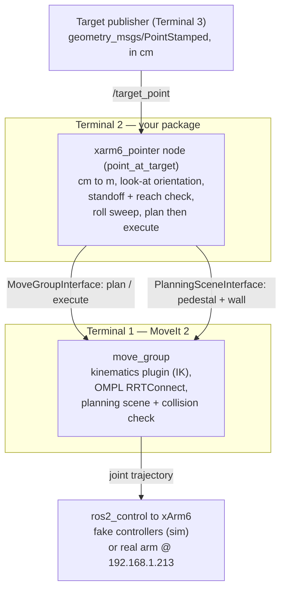

# xarm6_pointer

A ROS 2 (Humble) package that uses **MoveIt 2** to aim a UFactory **xArm6**'s end‑effector tool at arbitrary 3‑D points in space. You publish a target point on a topic; the node computes a "look‑at" pose, solves the inverse kinematics through MoveIt, plans a collision‑free motion, and executes it on the simulated or real arm.

Intended to be run on either the xArm **fake** MoveIt stack (RViz only) or the **realmove** stack (physical arm over Ethernet).

---

## What it does

Given a 3‑D target, point the **tool's +Z axis** at it from a configurable *standoff* distance, without touching the target and without colliding with the robot's own body or the mounting structure.

---

## How it works

The package is, at its core, an **inverse‑kinematics (IK) problem wrapped in a task‑space goal generator**. For context:

- **Inverse kinematics (IK)**: given a desired pose `T*`, find joint angles `q` such that `T(q) = T*`. Unlike Forward Kinematics, IK can have **no solution** (target outside the reachable workspace), a **finite set** of solutions (a generic 6‑DOF pose for a 6R arm admits up to eight discrete configurations — elbow up/down, wrist flips, etc.), or **infinitely many** (when the task under‑constrains the arm).

This package never writes its own IK solver — it constructs the *target pose* and hands it to MoveIt, which runs the configured kinematics plugin. What the package contributes is the geometry that turns a bare point into a well‑posed pose, plus the recognition that **pointing is a deliberately under‑constrained task**.

### 1. From a point to a pointing direction

The subscriber receives a `geometry_msgs/PointStamped` and converts it from centimeters to meters (see [Units](#coordinate-conventions-and-units)). The target is treated as a vector from the base origin, and the pointing direction is the unit vector along it:

```
n̂ = target / ‖target‖
```

`n̂` is the direction the tool's +Z axis should point. This is the "ray" model: the tool is aimed **along the base‑origin → target ray**.

### 2. Standoff and a reachable‑workspace pre‑check

The end‑effector is placed a fixed `standoff` distance short of the target, on that same ray:

```
ee_pos = target − n̂ · standoff
```

Before any IK or planning is attempted, `ee_pos` is checked against a coarse **reachable‑workspace envelope** — its Euclidean distance from the base origin must lie in `[min_reach, max_reach]`. This is a conservative way to reject obviously unreachable targets (the manipulator's reach is a bounded annulus around the base) before a full IK/planning call.

### 3. The look‑at orientation (constructing a rotation in SO(3))

A pointing task fixes which way +Z points, but a single direction does not define a full orientation — a rotation in `SO(3)` needs three independent parameters. The node builds a valid orientation by **Gram‑Schmidt orthogonalization** against a reference "up" vector:

```
x̂ = up × n̂          (perpendicular to both)
ŷ = n̂ × x̂           (completes the right‑handed frame)
R  = [ x̂ | ŷ | n̂ ]   (columns are the tool axes in base coordinates)
```

`R` is then converted to a quaternion `base_q`. The reference `up` is the world +Z, switched to world +X when `n̂` is within ~18° of vertical to avoid the degeneracy where `up × n̂` collapses to zero. `base_q` is the look‑at orientation with **roll = 0** about the pointing axis.

### 4. Roll is a free DOF — the task is functionally redundant

Aiming a tool at a point constrains only *five* degrees of freedom: three for position and two for the pointing direction. *Rotation about the pointing axis itself (roll) does not change where the tool points.* So even though the xArm6 is a non‑redundant 6‑DOF arm, the *pointing task* leaves a one‑parameter family of equally valid end‑effector orientations — roll is the redundant coordinate with respect to this task.

The node exploits that redundancy to find a configuration that is not only reachable but *collision‑free*. It samples `roll_samples` roll angles evenly over a full turn and, for each, composes the orientation in the **tool frame**:

```
q = base_q * q_roll        (intrinsic roll about the tool's own +Z)
```

The order matters: `base_q * q_roll` rotates about the tool axis; the reverse would rotate about the world axis and change the aim. Each `(ee_pos, q)` pair is a fully specified `SE(3)` pose handed to MoveIt. The *first roll* that yields a valid, collision‑free plan is executed.

### 5. MoveIt solves the IK and plans the motion

For each candidate pose, MoveIt:

1. Runs its **kinematics plugin** (KDL by default on most xArm configs — a numerical, Jacobian‑based solver) to find joint angles realizing the pose within the goal tolerances
2. Uses **OMPL / RRTConnect** (a sampling‑based, bidirectional rapidly‑exploring random tree) to plan a collision‑free joint‑space path from the current state to that IK solution, checking joint limits, self‑collision (via the SRDF), and the added scene objects along the way.

`plan()` and `execute()` are kept strictly separate — the arm only moves when a plan has already succeeded.

> **IK solver note.** Numerical solvers like KDL can fail to satisfy a tightly toleranced *orientation* goal even when one exists, because they get trapped in local minima. The node ships a `position_only` diagnostic mode that drops the orientation goal: if planning succeeds with `position_only:=true` but fails with full orientation, the kinematics plugin is the bottleneck, and switching to **TRAC‑IK** (a drop‑in plugin with better convergence on orientation‑constrained goals) is the usual fix.

### 6. Precision and the orientation tolerance

Because roll is supplied by the **roll sweep** (step 4), the goal **orientation tolerance must be kept tight** (`goal_orient_tol = 0.01 rad`). `MoveIt::setGoalOrientationTolerance()` applies its value about all three axes, so a *loose* value would not just free roll — it would let the achieved pointing axis itself drift, and because OMPL is non‑deterministic, every run would land somewhere different inside that tolerance ball. A loose 0.2 rad tolerance projects to roughly `0.2 × distance` of error downrange (≈ 40 cm at 2 m); the tight value collapses that to ≈ 2 cm. Keep this parameter tight for any task where repeatable aim matters.

---

## Architecture

The package runs as **three terminals**. Whichever process launches `move_group` owns the URDF/SRDF, so anything that changes the robot model (e.g. adding the tool) must go to **Terminal 1**, not the node's launch file.



| Terminal | Launches | Role |
|---|---|---|
| **1** | `planning_env.launch.py` (wraps the xArm `fake`/`realmove` stack) | Starts `move_group`, RViz, and `ros2_control`. Loads the URDF/SRDF **with the tool** via the xArm `add_other_geometry` mechanism. |
| **2** | `pointer_node.launch.py` | Starts the `point_at_target` node with the MoveIt configuration and pointing parameters. Builds its own MoveIt config only to pass parameters — it does **not** determine the URDF `move_group` uses. |
| **3** | `ros2 topic pub …` | Publishes target points on `/target_point`. |

---

## Dependencies

- **Ubuntu 22.04**, **ROS 2 Humble**
- **MoveIt 2**: `sudo apt install ros-humble-moveit`
- **xarm_ros2** (provides `xarm_moveit_config` and `uf_ros_lib` / `MoveItConfigsBuilder`), cloned into your workspace `src/`
- **Gazebo Classic 11** for simulation

---

## Build

```bash
cd ~/xarm_ws
colcon build --packages-select xarm6_pointer
source install/setup.bash
```

---

## Usage

### Simulation (RViz, fake controllers)

```bash
# Terminal 1 — MoveIt stack with the tool integrated into the model
ros2 launch xarm6_pointer planning_env.launch.py

# Terminal 2 — the pointer node
ros2 launch xarm6_pointer pointer_node.launch.py ee_link:=other_geometry_link

# Terminal 3 — publish a target (values are in centimetres; see Units)
ros2 topic pub --rate 2 --times 3 /target_point geometry_msgs/msg/PointStamped \
  "{header: {frame_id: 'link_base'}, point: {x: 50, y: 0.0, z: 30}}"
```

### Real robot

```bash
# Terminal 1
ros2 launch xarm6_pointer planning_env.launch.py is_live:=true robot_ip:=192.168.1.213

# Terminal 2
ros2 launch xarm6_pointer pointer_node.launch.py \
  controllers_name:=controllers ee_link:=other_geometry_link
```

> Always test in simulation first. Keep velocity/acceleration scaling low (0.05–0.10) on the real arm and keep an E‑stop within reach.

---

## Coordinate conventions and units

- Targets are interpreted in the **`link_base`** frame.
- **Targets are published in centimeters.** The subscription callback divides `x`, `y`, `z` by 100 to get meters, because the upstream tooling emits centimeters
- The tool's **+Z axis** is the pointing axis; the look‑at orientation aligns +Z with the base→target ray

---

## Parameters

Defaults shown are the `pointer_node.launch.py` launch defaults.

| Parameter | Default | Meaning |
|---|---|---|
| `standoff_distance` | `0.15` m | Distance the tool stops short of the target, along the pointing ray. |
| `min_reach` / `max_reach` | `0.20` / `0.65` m | Reachable‑workspace envelope checked before planning (xArm6 reach ≈ 0.70 m). |
| `vel_scale` / `acc_scale` | `0.1` / `0.1` | Velocity / acceleration scaling (0–1). Start slow. |
| `goal_pos_tol` | `0.01` m | Goal position tolerance. |
| `goal_orient_tol` | `0.01` rad | Goal orientation tolerance **about each axis** — keep tight (see [Precision](#6-precision-and-the-orientation-tolerance)). |
| `planning_time` | `2.0` s | Max planning time per roll sample. |
| `roll_samples` | `12` | Roll angles tried about the pointing axis (every 30°). |
| `position_only` | `false` | Diagnostic: plan to EE position only, ignore orientation. |
| `ee_link` | `other_geometry_link` | Tip link used for pointing. **Must match the link the xArm `add_other_geometry` adds** — verify against the loaded URDF. |
| `tool_length` / `tool_radius` | `0.1651` / `0.01905` m | Cylindrical tool dimensions fed into `add_other_geometry`. |
| `pedestal_size_{x,y,z}` | `0.762` / `1.524` / `0.8382` m | Pedestal collision box dimensions. |
| `pedestal_offset_{x,y}` | `0.0127` / `-0.6858` m | Pedestal centre offset from the arm base. |
| `wall_size_{x,y,z}` | `0.1` / `3.048` / `2.0` m | Wall collision box dimensions. |
| `wall_offset_{x,y}` | `-0.3937` / `0.0` m | Wall centre offset from the arm base. |

---

## Collision objects

Two boxes are added programmatically at startup through `PlanningSceneInterface::applyCollisionObject`, so they appear in both simulation and on the real arm's MoveIt planning scene:

- **`pedestal`** — the table under the arm, with its top face 1 mm below the base mounting plate (`z = -0.001`).
- **`wall`** — a vertical wall beside the work area.

The **tool** itself is *not* added here. It is integrated into the URDF and SRDF through the xArm xacro's `add_other_geometry` mechanism (passed in Terminal 1), which is why `planning_env.launch.py` carries the tool arguments. Adding the tool in Terminal 2 has no effect on the planning scene.

> These are *MoveIt* collision objects: they constrain planning. The xArm control box runs its own onboard self‑collision check that does not see them.

---

## Known issues and gotchas

- **Centimeter input.** The callback divides by 100. Publishing in metres gives 100× distances. (See [Units](#coordinate-conventions-and-units).)
- **Verify `ee_link`.** After `add_other_geometry`, confirm the tip link name in the loaded URDF and pass it as `ee_link`. Check with:
```bash
  ros2 param get /move_group robot_description | grep -oE 'link name="[^"]+"' | sort -u
```
- **xArm onboard self‑collision (error C22).** The control box's self‑collision check is stricter than MoveIt's SRDF check and can halt a motion MoveIt approved (typically folded, behind‑the‑robot configurations). Recover via *Clear Error* in xArm Studio, hand‑guide to a neutral pose in Manual Mode, then restart the terminals. Avoid around‑the‑back targets; sequence through safe intermediate poses.
- **Downward / ground targets.** In the "ray" model, `ee_pos` lies on the base→target ray, so points on the floor drive the end‑effector below the base (into the pedestal volume) or past the reach limit. Pointing at the ground generally requires approaching from *above* the target rather than along the base ray.
- **Repeatability ≠ accuracy.** Tight tolerances make the *aim* repeatable. Which roll the sweep selects can still vary between runs (OMPL is non‑deterministic), which moves the spot only if the tool/laser is *not* perfectly coaxial with the tool's +Z. For strict repeatability, run with `roll_samples:=1` (fixed roll) and confirm the tool is mounted on‑axis. Separately, if `ee_link` is not the tool's true tip, every shot carries a constant offset.

---

## References
- MoveIt 2 documentation — <https://moveit.picknik.ai/humble/>
- OMPL — <https://ompl.kavrakilab.org/>
