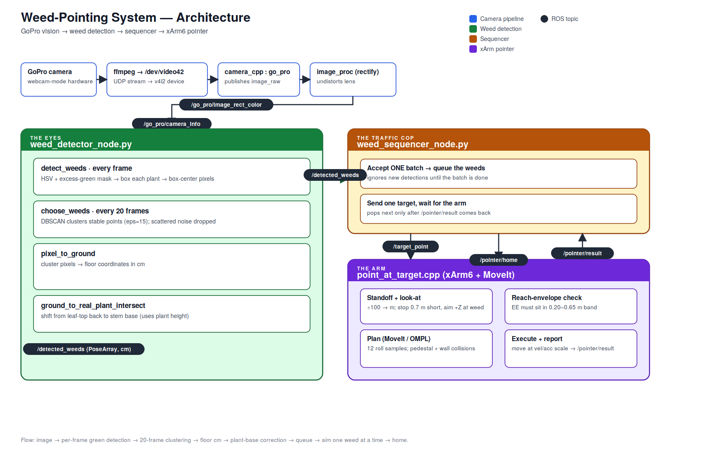

# xarm6_pointer + weed_detection

A ROS 2 (Humble) system that detects weeds in a GoPro camera feed and aims a UFACTORY xArm6 tool at each one. First a vision pipeline finds plants on the ground using color detection and converts their image positions into real-world coordinates. These positions are published as target points on a topic, and the pointer node computes a "look‑at" orientation, solves the inverse kinematics through MoveIt, plans a collision‑free motion, and executes it on the simulated or real arm.

Intended to be run on either the xArm **fake** MoveIt stack (RViz only) or the **realmove** stack (physical xArm over Ethernet).

---

## Architecture



The system is four subsystems connected by ROS topics:

- **Camera pipeline** turns the GoPro into a rectified ROS image stream (see References)
- **Weed detection** (`weed_detector_node`) finds plants and publishes their ground coordinates
- **Sequencer** (`weed_sequencer_node`) hands the arm one weed at a time.
- **xArm pointer** (`point_at_target`) plans and executes a pointing motion, then reports back

---

## How it works

#### 1. Camera Pipeline

The GoPro is put into webcam mode and streamed into a virtual video device, which a small C++ node republishes as a ROS image. This node was provided by @sandeepzachariah (see references)

### 2. Weed detection — `weed_detector_node`

Subscribes to the rectified image and builds detections over time rather than trusting any single frame:

- **`detect_weeds` (every frame)** —
  segments green vegetation (`segment_and_box_green`: an HSV color gate intersected with an excess-green check, cleaned up with morphological open/close and box-merging so each plant becomes one box), then
  returns the center pixel of each box.
- **`choose_weeds` (every `cluster_interval` frames)** —
  pools the centers from the window and runs **DBSCAN**. A real plant appears in the same spot across most frames and forms a tight cluster; flickering background reflections stay
  scattered and are discarded as noise.
- **`pixel_to_ground`** —
  converts each surviving cluster from pixels to real-world coordinates (centimeters) on the ground plane, using the camera intrinsics and
  geometry (height + tilt).

The result is published as a `PoseArray` (in cm, `link_base` frame) on
`/detected_weeds`.

### 3. Sequencer — `weed_sequencer_node`

The detector can publish a new batch periodically, but the arm services one weed at a time. The sequencer accepts a batch, queues the weeds, and sends the first
on `/target_point`. It waits for the arm's `/pointer/result` before sending the next, and signals `/pointer/home` when the batch is finished.

### 4. xArm pointer — `point_at_target`

Receives a target on `/target_point` (centimeters, `link_base` frame) and:
1. Converts from centimeters to meters. The target is treated as a vector from the base origin, and the pointing direction is the unit vector along it:
    ```
    n̂ = target / ‖target‖
    ```
    `n̂` is the direction the tool's +Z axis should point. This is the "ray" model: the tool is aimed **along the base‑origin → target ray**.

2. Computes a **standoff** pose — the end‑effector is placed a fixed `standoff` distance short of the target, on that same ray:
    ```
    ee_pos = target − n̂ · standoff
    ```  
    it stops a fixed distance short of the weed and aims the tool's **+Z axis** at it (a "look-at" orientation). 

3. Checks that the standoff pose is inside the arm's **reachable‑workspace envelope** — its Euclidean distance from the base origin must lie in `[min_reach, max_reach]`.

4. A pointing task fixes which way +Z points, but a single direction does not define a full orientation — a rotation in `SO(3)` needs three independent parameters. The node builds a valid orientation by **Gram‑Schmidt     orthogonalization** against a reference "up" vector:
    ```
    x̂ = up × n̂          (perpendicular to both)
    ŷ = n̂ × x̂           (completes the right‑handed frame)
    R  = [ x̂ | ŷ | n̂ ]   (columns are the tool axes in base coordinates)
    ```
   `R` is then converted to a quaternion `base_q`. The reference `up` is the world +Z, switched to world +X when `n̂` is within ~18° of vertical to avoid the degeneracy where `up × n̂` collapses to zero.
   `base_q` is the look‑at orientation with **roll = 0** about the pointing axis.

6. For each candidate pose, MoveIt:
    1. Runs its **kinematics plugin** (KDL by default on most xArm configs — a numerical, Jacobian‑based solver) to find joint angles realizing the pose within the goal tolerances
    2. Uses **OMPL / RRTConnect** (a sampling‑based, bidirectional rapidly‑exploring random tree) to plan a collision‑free joint‑space path from the current state to that IK solution, checking joint limits, self‑collision         (via the SRDF), and the added scene objects along the way.Plans a collision-free path with **MoveIt / OMPL**, sampling several roll angles about the pointing axis (rolling the tool doesn't change where it points, but         can dodge obstacles or joint limits). Pedestal and wall collision objects keep the arm clear of the rig.

7. Executes at the configured velocity/acceleration scaling and reports success/failure on `/pointer/result`.

---

## ROS topics

| Topic | Type | Direction | Notes |
|---|---|---|---|
| `/go_pro/image_raw` | `sensor_msgs/Image` | camera → image_proc | raw frames |
| `/go_pro/image_rect_color` | `sensor_msgs/Image` | image_proc → detector | rectified |
| `/go_pro/camera_info` | `sensor_msgs/CameraInfo` | image_proc → detector | intrinsics |
| `/detected_weeds` | `geometry_msgs/PoseArray` | detector → sequencer | weeds in cm, `link_base` |
| `/target_point` | `geometry_msgs/PointStamped` | sequencer → pointer | **centimeters**, `link_base` |
| `/pointer/result` | `std_msgs/Bool` | pointer → sequencer | success/failure handshake |
| `/pointer/home` | `std_msgs/Empty` | sequencer → pointer | park the arm |

> **Units:** `/target_point` is in **centimeters** and the pointer node divides
> by 100 internally. Ground-level targets use `z = -84` (the ground is ~0.84 m
> below the arm base).

## Build

```bash
cd ~/xarm_ws
colcon build --symlink-install
source install/setup.bash
```

## Usage

### Option A — the helper script

`run_real.sh` starts the GoPro webcam + ffmpeg stream and launches the three ROS
stacks in `tmux` windows:

```bash
    ./run_real.sh
    # attach to view logs:
    tmux attach-session -t ros2-xarm     # Ctrl-B p / n to switch windows
```

### Option B — manual, step by step

#### 1. GoPro → virtual webcam device
```bash
    sudo gopro webcam -n -p enp* ffmpeg -nostdin -threads 1 -i 'udp://@0.0.0.0:8554?overrun_nonfatal=1&fifo_size=50000000' \
  -f:v mpegts -fflags nobuffer -vf format=yuv420p -f v4l2 /dev/video42
```

##### 2. Planning environment + real robot connection
```bash
    ros2 launch xarm6_pointer planning_env.launch.py is_live:=true robot_ip:=192.168.1.213
```

##### 3. Pointer (control) node
```bash
    ros2 launch xarm6_pointer pointer_node.launch.py controllers_name:=controllers
```

#### 4. Weed detection + sequencer (also brings up the GoPro + image_proc nodes)
```bash
    ros2 launch weed_detection weed_detection.launch.py
```

### Option C - Run xArm Pointer in RViz

#### 1. MoveIt stack with the tool integrated into the model
```bash
    ros2 launch xarm6_pointer planning_env.launch.py
```

#### 2. The pointer node
```bash
    ros2 launch xarm6_pointer pointer_node.launch.py ee_link:=other_geometry_link
```

#### 3. Publish a target (centimeters; see Units)
```bash
    ros2 topic pub --rate 2 --times 3 /target_point geometry_msgs/msg/PointStamped \
  "{header: {frame_id: 'link_base'}, point: {x: 50, y: 0.0, z: 30}}"
```

Once all four are up, the detector will publish weeds, the sequencer will queue them, and the arm will point at each in turn before returning home.

## Configuration

### Pointer node (`pointer_node.launch.py`)

| Parameter | Default | Meaning |
|---|---|---|
| `standoff_distance` | `0.7` | meters the tool stops short of the target |
| `min_reach` / `max_reach` | `0.20` / `0.65` | EE distance-from-base envelope (m) |
| `vel_scale` / `acc_scale` | `0.5` / `0.1` | trajectory speed/accel scaling (start slow) |
| `goal_pos_tol` | `0.01` | goal position tolerance (m) |
| `goal_orient_tol` | `0.01` | goal orientation tolerance (rad) — keep tight |
| `roll_samples` | `12` | roll angles tried about the pointing axis |
| `planning_time` | `2.0` | max planning time per roll sample (s) |
| `tool_length` / `tool_radius` | `0.1651` / `0.01905` | mounted tool cylinder (m) |
| `pedestal_*` / `wall_*` | see launch | collision-object size and offset |

### Detector node (weed detection)

| Parameter | Default | Meaning |
|---|---|---|
| `cluster_interval` | `20` | frames pooled before clustering |
| `dbscan_eps` | `15.0` | cluster radius in pixels |
| `dbscan_min_fraction` | `0.8` | fraction of frames a cluster must appear in |
| `ground_plane_z` | — | ground height below the camera (cm, negative) |
| `camera_angle_deg` | — | camera tilt |
| `plant_height` | — | used for the leaf-to-stem correction |

> **Tuning note:** `dbscan_eps` trades off splitting vs. merging. Too small and a
> jittery plant fragments into noise and is dropped; too large and nearby plants
> merge. Raise `dbscan_eps` (not lower `dbscan_min_fraction`) if a real plant is
> being missed — lowering the fraction lets unstable background back in.

## Calibration

The pixel-to-ground mapping depends on the camera geometry (height, tilt, and
intrinsics from `/go_pro/camera_info`). If reported positions are skewed —
especially toward the edges of the image — re-verify the camera height and angle
parameters and confirm the live feed resolution/FOV match what the camera was
calibrated at. A reproject check (run known ground points through the mapping and
compare against tape-measured truth) is the quickest way to quantify the error.

## Debugging aids

- The detector opens an OpenCV debug window (`debug_view`) overlaying the green
  mask, per-frame boxes, and the published detections labeled with their ground
  coordinates. On a headless machine, disable it or publish a debug image topic
  instead.
- `choose_weeds` logs the per-window cluster count, each cluster's size/centroid/
  span, and the discarded noise — useful for seeing whether a missed plant is
  being detected but failing to cluster.

---

## Collision objects

Two boxes are added programmatically at startup through `PlanningSceneInterface::applyCollisionObject`, so they appear in both simulation and on the real arm's MoveIt planning scene:

- **`pedestal`** — the table under the arm, with its top face 1 mm below the base mounting plate (`z = -0.001`).
- **`wall`** — a vertical wall beside the work area.

The **tool** itself is *not* added here. It is integrated into the URDF and SRDF through the xArm xacro's `add_other_geometry` mechanism (passed in Terminal 1), which is why `planning_env.launch.py` carries the tool arguments. Adding the tool in Terminal 2 has no effect on the planning scene.

> These are *MoveIt* collision objects: they constrain planning. The xArm control box runs its own onboard self‑collision check that does not see them.

---

## Coordinate conventions and units

- Targets are interpreted in the **`link_base`** frame.
- **Targets are published in centimeters.** The subscription callback divides `x`, `y`, `z` by 100 to get meters, because the upstream tooling emits centimeters
- The tool's **+Z axis** is the pointing axis; the look‑at orientation aligns +Z with the base→target ray

---

## Dependencies

- **Ubuntu 22.04**, **ROS 2 Humble**
- **MoveIt 2**: `sudo apt install ros-humble-moveit`
- **xarm_ros2** (provides `xarm_moveit_config` and `uf_ros_lib` / `MoveItConfigsBuilder`), cloned into your workspace `src/`
- **Gazebo Classic 11** for simulation
- **image_proc**
- **camera_cpp** (GoPro publisher node, in this workspace)
- **Python**: `numpy`, `opencv-python` (`cv2`), `cv_bridge`, `scikit-learn` (DBSCAN)
- **GoPro** tooling: the `gopro` webcam CLI, `ffmpeg`, and `v4l2loopback`
- A **UFACTORY xArm6** reachable on the network

---

## Known issues and gotchas

- **Centimeter input.** The callback divides by 100. Publishing in metres gives 100× distances. (See [Units](#coordinate-conventions-and-units).)
- **Verify `ee_link`.** After `add_other_geometry`, confirm the tip link name in the loaded URDF and pass it as `ee_link`. Check with:
```bash
      ros2 param get /move_group robot_description | grep -oE 'link name="[^"]+"' | sort -u
```
- **xArm onboard self‑collision (error C22).** The control box's self‑collision check is stricter than MoveIt's SRDF check and can halt a motion MoveIt approved (typically folded, behind‑the‑robot configurations). Recover via *Clear Error* in xArm Studio, hand‑guide to a neutral pose in Manual Mode, then restart the terminals. Avoid around‑the‑back targets; sequence through safe intermediate poses.
- **Downward / ground targets.** In the "ray" model, `ee_pos` lies on the base→target ray, so points on the floor drive the end‑effector below the base (into the pedestal volume) or past the reach limit. Pointing at the ground generally requires approaching from *above* the target rather than along the base ray.
- **Repeatability ≠ accuracy.** Tight tolerances make the *aim* repeatable. Which roll the sweep selects can still vary between runs (OMPL is non‑deterministic), which moves the spot only if the tool/laser is *not* perfectly coaxial with the tool's +Z. For strict repeatability, run with `roll_samples:=1` (fixed roll) and confirm the tool is mounted on‑axis. Separately, if `ee_link` is not the tool's true tip, every shot carries a constant offset.

---

## References
- GoPro-ROS2 package - <https://github.com/sandeepzachariah/GoPro-ROS2>
- MoveIt 2 documentation — <https://moveit.picknik.ai/humble/>
- OMPL — <https://ompl.kavrakilab.org/>
